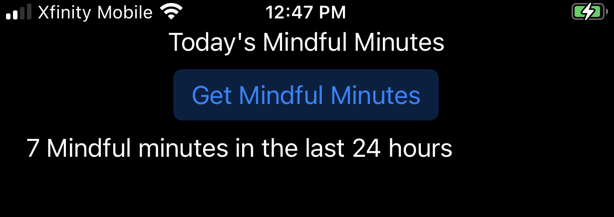

# mindful-minutes
This app allows the user to check their mindful minutes for the past 24 hours through use of the HealthKit API.

To enable Headspace to write mindful minutes to Apple's iOS Health App, follow these directions:
https://help.headspace.com/hc/en-us/articles/115003793088-How-do-I-connect-Headspace-to-the-iOS-Health-App-

Here is a helpful tutorial I used to fetch mindful minutes data: https://by.ben.church/How-to-read-and-write-Mindful-Minutes-from-iOS's-HealthKit-with-Swift/

This app is a demo of how one can access mindful minute data via the iOS HealthKit API.

## UI diagram


# Structure of Mindful Minutes messages
The Data that come from the HealthKit is an array of type HKCategorySample, 
wrapped as an optional array of HKSample ([HKSample]?).
Each HKSample instance is an entire meditation instance, or an interrupted meditation.
If the user pauses the app, the time is stopped, and that is recorded as a mindful instance.
When The user starts the session again, another mindful instance is started.

Here is how the data looks printed out as HKSample objects:
```
[
0 9153FB37-81CA-41C0-8EC4-4F757794CA07 "Headspace" (173082), "iPhone9,2" (15.4) (2022-03-20 12:42:27 -0400 - 2022-03-20 12:43:27 -0400), 
0 8D7F1DFC-EC1F-4EE5-A069-1490E93B2157 "Headspace" (173082), "iPhone9,2" (15.4) (2022-03-19 15:14:42 -0400 - 2022-03-19 15:17:42 -0400), 
0 4A15E70C-2E61-401F-91CB-F9D1D044D5C1 "Headspace" (173082), "iPhone9,2" (15.4) (2022-03-19 13:26:16 -0400 - 2022-03-19 13:28:59 -0400), 
0 ACF04A55-C365-4418-97EA-034ACEFBC5C3 "Headspace" (173082), "iPhone9,2" (15.4) (2022-03-19 13:25:29 -0400 - 2022-03-19 13:25:47 -0400)
]
```

Here are some printed values of data that the messages contain with explanatory title values:
```
category sample #0 values: 
	sample.startDate: 2022-03-20 16:42:27 +0000,
	sample.endDate: 2022-03-20 16:43:27 +0000,
	sample.sampleType: HKCategoryTypeIdentifierMindfulSession, 
	sample.sampleMetadata: nil,
	sample.description:0 9153FB37-81CA-41C0-8EC4-4F757794CA07 "Headspace" (173082), "iPhone9,2" (15.4) (2022-03-20 12:42:27 -0400 - 2022-03-20 12:43:27 -0400),
	sample.hasUndeterminedDuration: false
category sample #1 values: 
	sample.startDate: 2022-03-19 19:14:42 +0000,
	sample.endDate: 2022-03-19 19:17:42 +0000,
	sample.sampleType: HKCategoryTypeIdentifierMindfulSession, 
	sample.sampleMetadata: nil,
	sample.description:0 8D7F1DFC-EC1F-4EE5-A069-1490E93B2157 "Headspace" (173082), "iPhone9,2" (15.4) (2022-03-19 15:14:42 -0400 - 2022-03-19 15:17:42 -0400),
	sample.hasUndeterminedDuration: false
category sample #2 values: 
	sample.startDate: 2022-03-19 17:26:16 +0000,
	sample.endDate: 2022-03-19 17:28:59 +0000,
	sample.sampleType: HKCategoryTypeIdentifierMindfulSession, 
	sample.sampleMetadata: nil,
	sample.description:0 4A15E70C-2E61-401F-91CB-F9D1D044D5C1 "Headspace" (173082), "iPhone9,2" (15.4) (2022-03-19 13:26:16 -0400 - 2022-03-19 13:28:59 -0400),
	sample.hasUndeterminedDuration: false
category sample #3 values: 
	sample.startDate: 2022-03-19 17:25:29 +0000,
	sample.endDate: 2022-03-19 17:25:47 +0000,
	sample.sampleType: HKCategoryTypeIdentifierMindfulSession, 
	sample.sampleMetadata: nil,
	sample.description:0 ACF04A55-C365-4418-97EA-034ACEFBC5C3 "Headspace" (173082), "iPhone9,2" (15.4) (2022-03-19 13:25:29 -0400 - 2022-03-19 13:25:47 -0400),
	sample.hasUndeterminedDuration: false
```

The total time for these instances is 421.49405908584595 seconds (or 7 minutes).